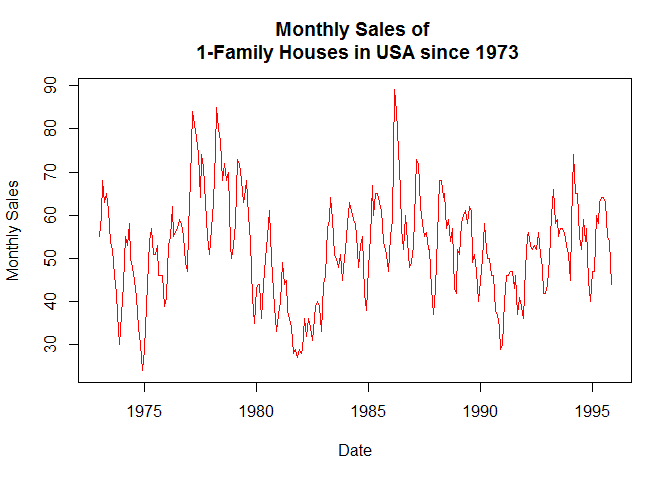
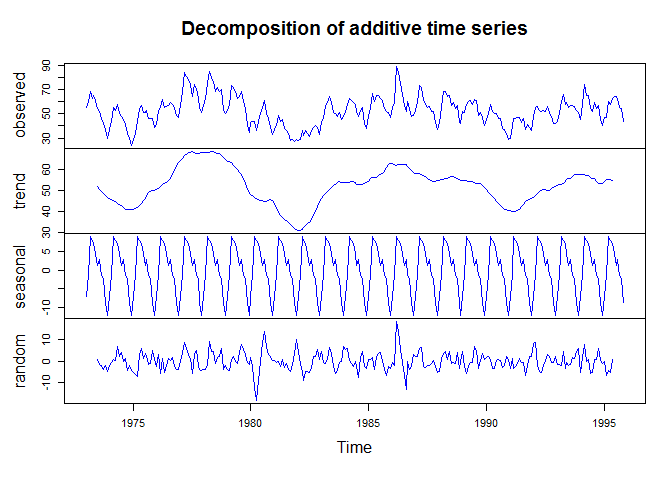

# Unit 11 Assignment
###### Logan Gage
###### November 17, 2016


```r
source("Analysis/hsalesPlot.R", echo=TRUE)
```

```
## 
## > plot(hsales, col = "red", lwd = 1.5, ylab = "Monthly Sales", 
## +     xlab = "Date", main = "Monthly Sales of \n 1-Family Houses in USA since 1973")
```

<!-- -->


```r
source("Analysis/hsalesDecomp.R", echo=TRUE)
```

```
## 
## > data <- decompose(hsales)
## 
## > plot(data, col = "blue")
```

<!-- -->

